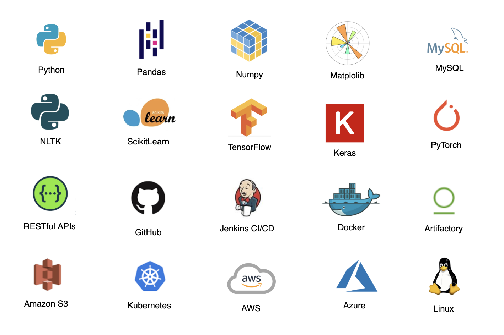

### Mariah Sonja :white_check_mark:

Hi, I am a passionate **Machine Learning Engineer** interested in anything around Artifitial Intelligence, especially when it involves *productionalization* of Machine Learning and Deep Learning models, Natural Laguage Processing (NLP) and Anomaly Detection.

**About me** 
- Computer Science graduate and postgraduate with multiple certificates in Data Analysis, Data Science and Machine Learning/Deep Learning.
- Business Administration graduate and postgraduate qualified in Business Intelligence – Corporate Strategy.

**Technical skills**

 
📫 **Contact me**

mariahsonja@hotmail.com

<!--
**mariahsonja/mariahsonja** is a ✨ _special_ ✨ repository because its `README.md` (this file) appears on your GitHub profile.

-->
